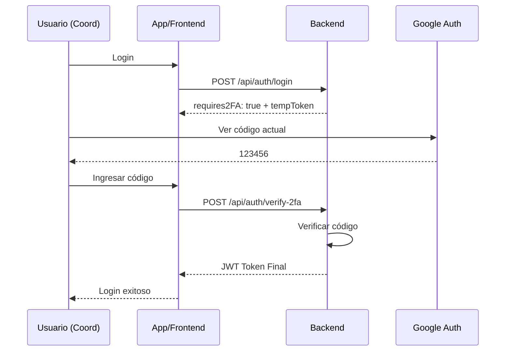

# 🔐 Seguridad Avanzada - Guía Completa

## ✅ Características Implementadas

1. **CSRF Protection** - Protección contra Cross-Site Request Forgery
2. **2FA (Two-Factor Authentication)** - Autenticación de dos factores para coordinación
3. **Audit Logging** - Registro de todas las acciones críticas
4. **Login Attempts Tracking** - Rastreo de intentos de inicio de sesión

---

## 📦 Instalación

Las dependencias ya están instaladas:

```bash
npm install csrf-csrf speakeasy qrcode passport cookie-parser
```

---

## 🗄️ Configuración de Base de Datos

**IMPORTANTE**: Ejecutar este script para crear las tablas necesarias:

```bash
mysql -u root -p sgt < database/security_tables.sql
```

Esto crea 4 tablas:

- `audit_log` - Registro de auditoría
- `two_factor_auth` - Configuración de 2FA
- `login_attempts` - Intentos de login
- `user_sessions` - Sesiones activas

---

## ⚙️ Configuración

Agregar a `.env`:

```env
# CSRF Secret
CSRF_SECRET=cambiar_por_secreto_aleatorio_de_32_caracteres

# Generar con:
# node -e "console.log(require('crypto').randomBytes(32).toString('hex'))"
```

---

## 🔢 2FA - Autenticación de Dos Factores

### Uso (Solo para Coordinación)

#### 1. **Setup Inicial**

```bash
POST /api/2fa/setup
Headers: Authorization: Bearer TOKEN_COORDINACION

Response:
{
  "success": true,
  "message": "Escanea el código QR con Google Authenticator",
  "secret": "JBSWY3DPEHPK3PXP",
  "qrCode": "data:image/png;base64,iVBOR...",
  "backupCodes": [
    "A3B4C5D6",
    "E7F8G9H0",
    ...
  ]
}
```

**¿Qué hacer?**

1. Escanear el `qrCode` con Google Authenticator
2. Guardar los `backupCodes` en lugar seguro
3. La app mostrará un código de 6 dígitos

#### 2. **Habilitar 2FA**

```bash
POST /api/2fa/enable
Headers: Authorization: Bearer TOKEN
Body: {
  "token": "123456"  // Código de Google Authenticator
}

Response:
{
  "success": true,
  "message": "2FA habilitado correctamente"
}
```

#### 3. **Login con 2FA**

Una vez habilitado 2FA, el login requiere dos pasos:

**Paso 1:** Login normal

```bash
POST /api/auth/login
Body: {
  "username": "coordinacion",
  "password": "password"
}

Response:
{
  "requires2FA": true,
  "tempToken": "temp_token_for_2fa_validation"
}
```

**Paso 2:** Validar código 2FA

```bash
POST /api/auth/verify-2fa
Body: {
  "tempToken": "temp_token_from_step1",
  "token": "123456"  // Código actual de Google Authenticator
}

Response:
{
  "message": "Login correcto",
  "token": "JWT_TOKEN_FINAL",
  "user": { ... }
}
```

#### 4. **Ver Estado 2FA**

```bash
GET /api/2fa/status
Headers: Authorization: Bearer TOKEN

Response:
{
  "success": true,
  "habilitado": true
}
```

#### 5. **Deshabilitar 2FA**

```bash
POST /api/2fa/disable
Headers: Authorization: Bearer TOKEN

Response:
{
  "success": true
}
```

---

## 🛡️ CSRF Protection

### Configuración en Frontend

#### 1. **Obtener Token CSRF**

```javascript
// Al cargar la aplicación
const response = await fetch("http://localhost:3000/api/csrf-token", {
  credentials: "include", // IMPORTANTE: incluir cookies
});

const { csrfToken } = await response.json();
localStorage.setItem("csrfToken", csrfToken);
```

#### 2. **Incluir en Requests**

```javascript
// Opción 1: Header (recomendado)
fetch('http://localhost:3000/api/coordinacion/proyecto/aprobar/1', {
  method: 'POST',
  headers: {
    'Authorization': `Bearer ${jwtToken}`,
    'X-CSRF-Token': localStorage.getItem('csrfToken'),
    'Content-Type': 'application/json'
  },
  credentials: 'include',
  body: JSON.stringify({ ... })
});

// Opción 2: En el body
fetch('...', {
  method: 'POST',
  body: JSON.stringify({
    _csrf: localStorage.getItem('csrfToken'),
    ...otherData
  })
});
```

### Métodos Protegidos

- ✅ POST, PUT, DELETE - Requieren CSRF token
- ⚪ GET, HEAD, OPTIONS - No requieren

### Manejo de Errores

```javascript
try {
  const response = await fetch(...);

  if (response.status === 403) {
    const error = await response.json();
    if (error.error === "CSRF token inválido o faltante") {
      // Obtener nuevo token
      await refreshCSRFToken();
      // Reintentar request
    }
  }
} catch (error) {
  console.error(error);
}
```

---

## 📊 Auditoría de Logs

### Ver Logs (Solo Coordinación)

```bash
GET /api/audit/logs?accion=APROBAR_PROYECTO&limit=50
Headers: Authorization: Bearer TOKEN_COORDINACION

Response:
{
  "success": true,
  "logs": [
    {
      "id_audit": 123,
      "id_usuario": 1,
      "usuario_nombre": "Juan Pérez",
      "rol": "COORDINACION",
      "accion": "APROBAR_PROYECTO",
      "entidad": "proyecto",
      "id_entidad": 5,
      "detalles": { "motivo": "Cumple requisitos" },
      "ip_address": "192.168.1.100",
      "fecha_hora": "2025-12-28T10:30:00"
    }
  ],
  "total": 1
}
```

### Filtros Disponibles

| Parámetro     | Descripción            | Ejemplo                    |
| ------------- | ---------------------- | -------------------------- |
| `id_usuario`  | Filtrar por usuario    | `?id_usuario=1`            |
| `accion`      | Tipo de acción         | `?accion=APROBAR_PROYECTO` |
| `entidad`     | Tipo de entidad        | `?entidad=proyecto`        |
| `fecha_desde` | Desde fecha            | `?fecha_desde=2025-12-01`  |
| `fecha_hasta` | Hasta fecha            | `?fecha_hasta=2025-12-31`  |
| `limit`       | Cantidad de resultados | `?limit=100`               |

### Acciones Registradas Automáticamente

**Proyectos:**

- SUBIR_PROYECTO
- APROBAR_PROYECTO_FORMATO
- OBSERVAR_PROYECTO_FORMATO
- APROBAR_ASESOR
- RECHAZAR_ASESOR
- ASIGNAR_JURADOS
- APROBAR_PROYECTO_ASESOR
- OBSERVAR_PROYECTO_ASESOR
- APROBAR_PROYECTO_JURADO
- OBSERVAR_PROYECTO_JURADO

**Borradores:**

- SUBIR_BORRADOR
- APROBAR_BORRADOR_COORD
- APROBAR_BORRADOR_ASESOR
- APROBAR_BORRADOR_JURADO

**Sustentación:**

- PROGRAMAR_SUSTENTACION
- GENERAR_RESOLUCION
- REGISTRAR_RESULTADO_SUSTENTACION
- GENERAR_ACTA

**Seguridad:**

- LOGIN_EXITOSO
- LOGIN_FALLIDO
- HABILITAR_2FA
- DESHABILITAR_2FA

### Estadísticas de Login

```bash
GET /api/audit/login-stats?dias=7
Headers: Authorization: Bearer TOKEN_COORDINACION

Response:
{
  "success": true,
  "stats": [
    {
      "fecha": "2025-12-28",
      "total": 45,
      "exitosos": 42,
      "fallidos": 3
    },
    {
      "fecha": "2025-12-27",
      "total": 38,
      "exitosos": 35,
      "fallidos": 3
    }
  ],
  "dias": 7
}
```

---

## 🔧 Integración en Código

### Registrar Auditoría Manual

```javascript
const { registrarAuditoria, ACCIONES_AUDITORIA } = require("../utils/audit");

// En cualquier controller
await registrarAuditoria(
  req.user.id_usuario, // ID del usuario
  ACCIONES_AUDITORIA.APROBAR_PROYECTO_ASESOR, // Acción
  "proyecto", //Entidad
  id_proyecto, // ID de la entidad
  {
    // Detalles adicionales (JSON)
    observaciones: "Aprobado sin cambios",
    nota: 18,
  },
  req // Request (para IP y user agent)
);
```

---

## 📱 Flujo Completo de 2FA



---

## 🚀 Uso en Producción

### Checklist Antes de Producción

- [ ] Ejecutar `database/security_tables.sql`
- [ ] Configurar `CSRF_SECRET` en `.env`
- [ ] Habilitar HTTPS (requerido para cookies seguras)
- [ ] Configurar 2FA para coordinadores
- [ ] Verificar logs de auditoría funcionando
- [ ] Probar CSRF en endpoints críticos

### Variables de Entorno

```env
# Agregar a .env
CSRF_SECRET=secreto_aleatorio_32_caracteres
NODE_ENV=production
```

---

## 🧪 Pruebas

### Probar 2FA

```bash
# 1. Setup
curl -X POST http://localhost:3000/api/2fa/setup \
  -H "Authorization: Bearer TOKEN_COORD"

# 2. Escanear QR y obtener código

# 3. Habilitar
curl -X POST http://localhost:3000/api/2fa/enable \
  -H "Authorization: Bearer TOKEN_COORD" \
  -H "Content-Type: application/json" \
  -d '{"token":"123456"}'
```

### Probar CSRF

```bash
# Obtener token
curl -c cookies.txt http://localhost:3000/api/csrf-token

# Usar token en request
curl -b cookies.txt -X POST http://localhost:3000/api/coordinacion/proyecto/1/aprobar \
  -H "X-CSRF-Token: TOKEN_FROM_PREVIOUS_RESPONSE" \
  -H "Authorization: Bearer JWT_TOKEN"
```

---

## ⚠️ Troubleshooting

### 2FA no funciona

- Verificar que la tabla `two_factor_auth` existe
- Verificar que el reloj del servidor está sincronizado
- Usar códigos de backup si el código falla

### CSRF siempre falla

- Verificar que las cookies están habilitadas
- En desarrollo: `secure: false` en cookieOptions
- Verificar que `credentials: 'include'` en fetch

### Logs de auditoría vacíos

- Ejecutar `database/security_tables.sql`
- Verificar que la función `registrarAuditoria` se llama

---

## 📚 Archivos Creados

| Archivo                               | Propósito             |
| ------------------------------------- | --------------------- |
| `database/security_tables.sql`        | Schema de tablas      |
| `utils/audit.js`                      | Utilidad de auditoría |
| `utils/twoFactor.js`                  | Utilidad de 2FA       |
| `middleware/csrfProtection.js`        | Middleware CSRF       |
| `controllers/twoFactor.controller.js` | Controller 2FA        |
| `controllers/audit.controller.js`     | Controller auditoría  |
| `routes/twoFactor.routes.js`          | Rutas 2FA             |
| `routes/audit.routes.js`              | Rutas auditoría       |
| `routes/csrf.routes.js`               | Ruta CSRF token       |

---

## 🎯 Próximos Pasos (Opcional)

1. **OAuth2**: Agregar login con Google/Microsoft
2. **Rate limiting por IP**: Bloquear IPs sospechosas
3. **Notificaciones de seguridad**: Emails cuando se habilita 2FA
4. **Dashboard de auditoría**: Interfaz visual para logs

---

**Sistema de Seguridad Avanzada** - © 2025 SGT
