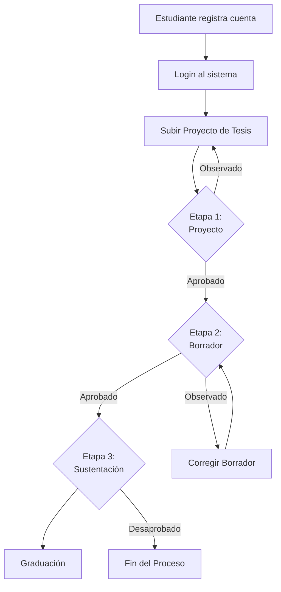
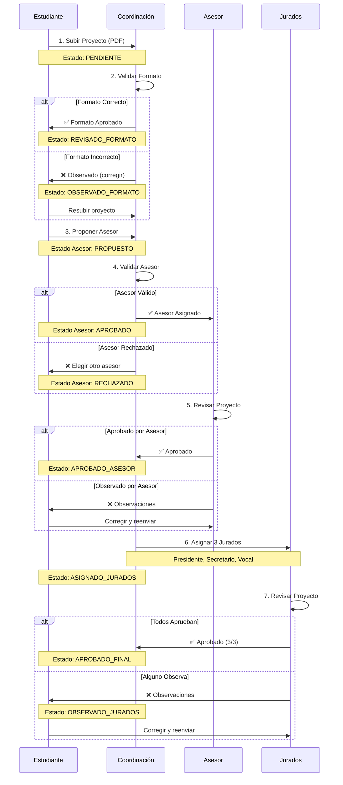
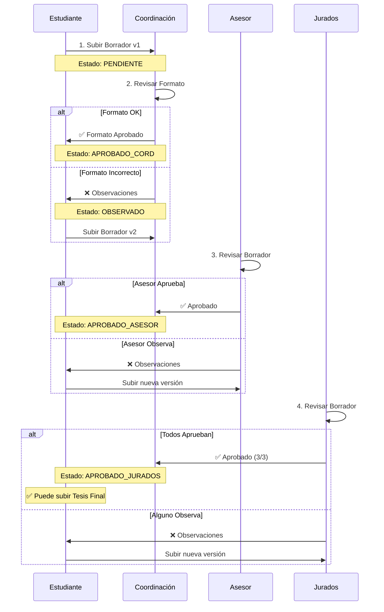
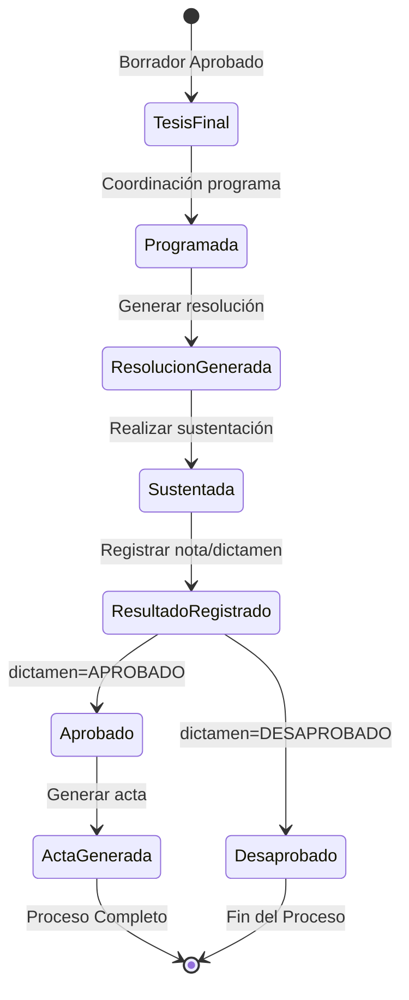
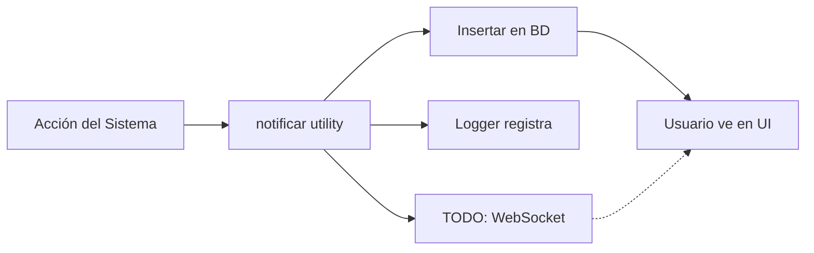
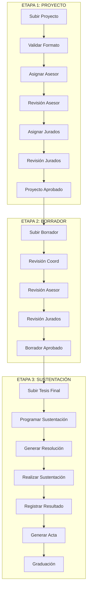

# 📘 Sistema de Gestión de Tesis (SGT) - Documentación Completa de Flujos

## Tabla de Contenidos

- [Flujo General del Sistema](#flujo-general-del-sistema)
- [Etapa 1: Proyecto de Tesis](#etapa-1-proyecto-de-tesis)
- [Etapa 2: Borrador de Tesis](#etapa-2-borrador-de-tesis)
- [Etapa 3: Tesis Final y Sustentación](#etapa-3-tesis-final-y-sustentación)
- [Flujos Secundarios](#flujos-secundarios)

---

## Flujo General del Sistema



---

## Etapa 1: Proyecto de Tesis

### Objetivo

Aprobar el proyecto de tesis a través de revisiones del asesor y jurados.

### Participantes

- **Estudiante**: Presenta y corrige el proyecto
- **Coordinación**: Valida formato, asigna asesor y jurados
- **Asesor**: Revisa y aprueba/observa el proyecto
- **Jurados** (3): Revisan y aprueban/observan el proyecto

### Diagrama de Flujo Detallado



### Estados del Proyecto

| Estado              | Descripción                           | Siguiente Acción               |
| ------------------- | ------------------------------------- | ------------------------------ |
| `PENDIENTE`         | Proyecto subido, esperando validación | Coordinación revisa formato    |
| `OBSERVADO_FORMATO` | Formato incorrecto                    | Estudiante corrige y resubmite |
| `REVISADO_FORMATO`  | Formato aprobado                      | Estudiante propone asesor      |
| `APROBADO_ASESOR`   | Asesor aprobó el proyecto             | Coordinación asigna jurados    |
| `ASIGNADO_JURADOS`  | Jurados asignados                     | Jurados revisan                |
| `OBSERVADO_JURADOS` | Uno o más jurados observaron          | Estudiante corrige             |
| `APROBADO_JURADOS`  | Todos los jurados aprobaron           | -                              |
| `APROBADO_FINAL`    | Proyecto completamente aprobado       | Pasa a Etapa 2                 |

### API Endpoints - Etapa 1

**Estudiante:**

```
POST   /api/estudiante/proyecto/subir
POST   /api/estudiante/proyecto/:id/elegir-asesor
GET    /api/estudiante/mis-proyectos
```

**Coordinación:**

```
POST   /api/coordinacion/proyecto/:id/validar-formato
POST   /api/coordinacion/proyecto/:id/validar-asesor
POST   /api/coordinacion/proyecto/:id/asignar-jurados
GET    /api/coordinacion/proyectos-pendientes
```

**Asesor:**

```
POST   /api/asesor/proyecto/:id/revisar
GET    /api/asesor/proyectos-pendientes
```

**Jurado:**

```
POST   /api/jurado/proyecto/:id/revisar
GET    /api/jurado/proyectos-pendientes
```

---

## Etapa 2: Borrador de Tesis

### Objetivo

Iterar sobre el borrador de tesis hasta obtener aprobación de asesor y jurados.

### Características

- **Múltiples iteraciones**: El borrador puede tener varias versiones
- **Revisión secuencial**: Primero coordinación, luego asesor, finalmente jurados

### Diagrama de Flujo



### Estados del Borrador

| Estado             | Descripción                             |
| ------------------ | --------------------------------------- |
| `PENDIENTE`        | Borrador subido, esperando coordinación |
| `OBSERVADO`        | Coordinación observó el formato         |
| `APROBADO_CORD`    | Coordinación aprobó, espera asesor      |
| `APROBADO_ASESOR`  | Asesor aprobó, espera jurados           |
| `APROBADO_JURADOS` | Todos aprobaron, listo para tesis final |

### Versionamiento

Cada borrador tiene un `numero_iteracion`:

- v1, v2, v3... hasta que sea aprobado
- Se mantiene historial completo de todas las versiones

### API Endpoints - Etapa 2

**Estudiante:**

```
POST   /api/estudiante/borrador/subir
GET    /api/estudiante/mis-borradores
```

**Coordinación:**

```
POST   /api/coordinacion/borrador/:id/revisar-formato
GET    /api/coordinacion/borradores-pendientes
```

**Asesor:**

```
POST   /api/asesor/borrador/:id/revisar
GET    /api/asesor/borradores-pendientes
```

**Jurado:**

```
POST   /api/jurado/borrador/:id/revisar
GET    /api/jurado/borradores-pendientes
```

---

## Etapa 3: Tesis Final y Sustentación

### Objetivo

Completar el proceso de titulación mediante la sustentación exitosa.

### Diagrama de Flujo Completo



### Proceso Detallado

#### 3.1 Subir Tesis Final

**Responsable:** Estudiante  
**Prerequisito:** Borrador aprobado por todos

```javascript
POST /api/estudiante/tesis-final/subir
Body: { id_proyecto, archivo: PDF }
```

**Resultado:** Tesis final registrada en base de datos

---

#### 3.2 Programar Sustentación

**Responsable:** Coordinación  
**Prerequisitos:**

- Tesis final subida
- Asesor asignado
- 3 jurados asignados

```javascript
POST /api/coordinacion/sustentacion/programar/:id_proyecto
Body: {
  fecha_hora: "2026-01-15T10:00:00",
  modalidad: "PRESENCIAL | VIRTUAL",
  lugar: "Auditorio Principal"
}
```

**Estado:** `PROGRAMADA`

**Notificaciones enviadas a:**

- ✉️ Estudiante
- ✉️ Asesor
- ✉️ 3 Jurados

---

#### 3.3 Generar Resolución

**Responsable:** Coordinación  
**Prerequisito:** Sustentación programada

```javascript
POST /api/sustentacion/generar-resolucion/:id_proyecto
```

**Proceso:**

1. Genera número único: `XXX-YYYY-FISeIC-UNU`
2. Crea PDF con datos del proyecto
3. Guarda en `/uploads/resoluciones/`
4. Notifica al estudiante

**Número de Resolución:**

- Formato: `001-2025-FISeIC-UNU`
- Correlativo anual
- **Protección contra duplicados** con `SELECT FOR UPDATE`

---

#### 3.4 Realizar Sustentación

**Responsables:** Estudiante + Asesor + Jurados  
**Fecha/Hora:** Según programación

**Evaluación:**

- Presidente del jurado conduce
- Secretario toma acta
- Vocal participa en evaluación
- Nota: 0-20
- Dictamen: APROBADO / DESAPROBADO

---

#### 3.5 Registrar Resultado

**Responsable:** Coordinación (después de la sustentación)

```javascript
POST /api/sustentacion/registrar-resultado/:id_sustentacion
Body: {
  nota: 18,
  dictamen: "APROBADO",
  observaciones: "Excelente trabajo"
}
```

**Estado:** `SUSTENTADA`

**Si APROBADO:** Continúa a generar acta  
**Si DESAPROBADO:** Fin del proceso

---

#### 3.6 Generar Acta

**Responsable:** Coordinación  
**Prerequisito:** Resultado registrado con dictamen=APROBADO

```javascript
POST /api/sustentacion/generar-acta/:id_sustentacion
```

**Proceso:**

1. Genera número único: `XXX-YYYY-FISeIC`
2. Crea PDF con todos los datos
3. Guarda en `/uploads/actas/`
4. Notifica a todos los participantes

**Número de Acta:**

- Formato: `001-2025-FISeIC`
- Correlativo anual
- **Protección contra duplicados** con `SELECT FOR UPDATE`

---

### Modalidades de Sustentación

| Modalidad    | Lugar                   | Requerimientos                |
| ------------ | ----------------------- | ----------------------------- |
| `PRESENCIAL` | Auditorio universitario | Jurados presentes físicamente |
| `VIRTUAL`    | Plataforma online       | Link de reunión requerido     |

### API Endpoints - Etapa 3

**Estudiante:**

```
POST   /api/estudiante/tesis-final/subir
GET    /api/estudiante/mis-resoluciones
GET    /api/estudiante/mi-acta
```

**Coordinación:**

```
POST   /api/coordinacion/sustentacion/programar/:id_proyecto
POST   /api/sustentacion/registrar-resultado/:id_sustentacion
POST   /api/sustentacion/generar-resolucion/:id_proyecto
POST   /api/sustentacion/generar-acta/:id_sustentacion
GET    /api/coordinacion/sustentaciones-programadas
```

**Descarga de Documentos:**

```
GET    /api/sustentacion/resolucion/:id_resolucion/descargar
GET    /api/sustentacion/acta/:id_acta/descargar
```

---

## Flujos Secundarios

### Notificaciones

Cada acción importante genera notificaciones automáticas:



**Ejemplos de notificaciones:**

- Proyecto aprobado por asesor
- Jurados asignados
- Borrador observado
- Sustentación programada
- Resolución generada
- Acta lista para descarga

### Sistema de Revisiones

Todas las revisiones siguen el mismo patrón:

```javascript
{
  estado: "APROBADO" | "OBSERVADO",
  observaciones: "Texto con comentarios",
  fecha_revision: timestamp
}
```

**Tablas de revisiones:**

- `revision_proyecto_asesor`
- `revision_proyecto_jurado`
- `revision_borrador_asesor`
- `revision_borrador_jurado`

---

## Resumen de Estados Globales

### Proyecto de Tesis

```
PENDIENTE → OBSERVADO_FORMATO → REVISADO_FORMATO →
APROBADO_ASESOR → ASIGNADO_JURADOS → OBSERVADO_JURADOS →
APROBADO_JURADOS → APROBADO_FINAL
```

### Borrador de Tesis

```
PENDIENTE → OBSERVADO → APROBADO_CORD →
APROBADO_ASESOR → APROBADO_JURADOS
```

### Sustentación

```
PROGRAMADA → SUSTENTADA → (APROBADO/DESAPROBADO)
```

### Tesis Final

```
PENDIENTE → SUSTENTADA → GRADUADO
```

---

## Tiempos Estimados por Etapa

| Etapa                 | Tiempo Mínimo | Tiempo Promedio |
| --------------------- | ------------- | --------------- |
| Etapa 1: Proyecto     | 2 semanas     | 1-2 meses       |
| Etapa 2: Borrador     | 1 mes         | 3-6 meses       |
| Etapa 3: Sustentación | 2 semanas     | 1 mes           |
| **Total**             | **2 meses**   | **5-9 meses**   |

---

## Diagrama Completo del Sistema



---

Para más detalles técnicos:

- **Base de Datos:** Ver `database_diagram.md`
- **Seguridad:** Ver `SECURITY.md`
- **Logging:** Ver `LOGGING.md`
- **Notificaciones:** Ver `NOTIFICATIONS.md`
- **Race Conditions:** Ver `RACE_CONDITIONS.md`
