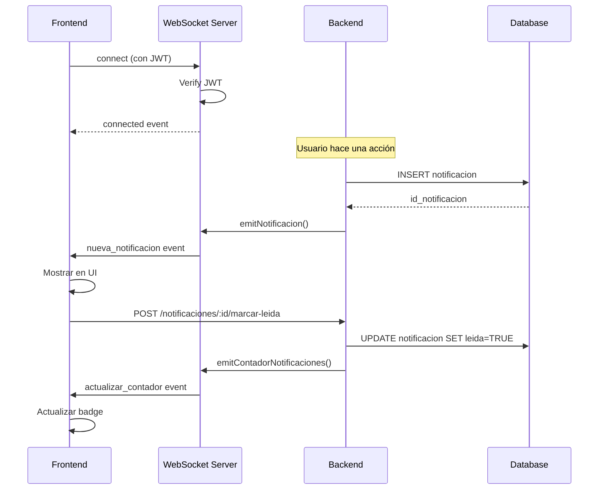

# 🔌 WebSockets - Notificaciones en Tiempo Real

## ✅ Implementación Completa

El sistema ahora soporta notificaciones en tiempo real usando **Socket.io** con autenticación JWT.

---

## 📦 Instalación

Ya está instalado:

```bash
npm install socket.io
```

---

## 🚀 Uso en Frontend

### 1. Instalar Cliente Socket.io

```bash
npm install socket.io-client
```

### 2. Conectar al Servidor

```javascript
import { io } from "socket.io-client";

// Obtener token JWT del login
const token = localStorage.getItem("token");

// Conectar al servidor WebSocket
const socket = io("http://localhost:3000", {
  auth: {
    token: token,
  },
  transports: ["websocket", "polling"],
});

// Evento de conexión exitosa
socket.on("connected", (data) => {
  console.log("✅ Conectado al servidor de notificaciones", data);
});

// Escuchar nuevas notificaciones
socket.on("nueva_notificacion", (notificacion) => {
  console.log("🔔 Nueva notificación:", notificacion);

  // Mostrar notificación en la UI
  mostrarNotificacion(notificacion);

  // Actualizar lista de notificaciones
  agregarNotificacionALista(notificacion);
});

//  Escuchar actualizaciones de contador
socket.on("actualizar_contador", (data) => {
  console.log(`📊 Notificaciones no leídas: ${data.no_leidas}`);

  // Actualizar badge en la UI
  actualizarBadge(data.no_leidas);
});

// Manejo de errores
socket.on("connect_error", (error) => {
  console.error("Error de conexión:", error.message);

  if (error.message === "Authentication error: Token inválido") {
    // Token expirado - hacer logout
    handleLogout();
  }
});

// Manejo de desconexión
socket.on("disconnect", () => {
  console.warn("⚠️ Desconectado del servidor");
});
```

### 3. Ejemplo Completo con React

```javascript
// hooks/useNotifications.js
import { useEffect, useState } from "react";
import { io } from "socket.io-client";

export const useNotifications = (token) => {
  const [notificaciones, setNotificaciones] = useState([]);
  const [noLeidas, setNoLeidas] = useState(0);
  const [connected, setConnected] = useState(false);

  useEffect(() => {
    if (!token) return;

    const socket = io("http://localhost:3000", {
      auth: { token },
    });

    socket.on("connected", () => {
      setConnected(true);
      console.log("✅ WebSocket conectado");
    });

    socket.on("nueva_notificacion", (notif) => {
      setNotificaciones((prev) => [notif, ...prev]);
      setNoLeidas((prev) => prev + 1);

      //Mostrar toast/snackbar
      showToast(notif.titulo, notif.mensaje);
    });

    socket.on("actualizar_contador", ({ no_leidas }) => {
      setNoLeidas(no_leidas);
    });

    socket.on("disconnect", () => {
      setConnected(false);
    });

    return () => {
      socket.disconnect();
    };
  }, [token]);

  return { notificaciones, noLeidas, connected };
};

// Componente
function App() {
  const token = localStorage.getItem("token");
  const { notificaciones, noLeidas, connected } = useNotifications(token);

  return (
    <div>
      <header>
        <NotificationBell count={noLeidas} />
        <ConnectionStatus connected={connected} />
      </header>

      <NotificationList items={notificaciones} />
    </div>
  );
}
```

### 4. Ejemplo con Vue.js

```javascript
// plugins/socket.js
import { io } from 'socket.io-client';

export default {
  install(app) {
    const socket = io('http://localhost:3000', {
      auth: {
        token: localStorage.getItem('token')
      },
      autoConnect: false
    });

    app.config.globalProperties.$socket = socket;
    app.provide('socket', socket);
  }
};

// store/notifications.js
export const useNotificationStore = defineStore('notifications', {
  state: () => ({
    notificaciones: [],
    noLeidas: 0,
    connected: false
  }),

  actions: {
    initSocket(socket) {
      socket.on('connected', () => {
        this.connected = true;
      });

      socket.on('nueva_notificacion', (notif) => {
        this.notificaciones.unshift(notif);
        this.noLeidas++;
      });

      socket.on('actualizar_contador', ({ no_leidas }) => {
        this.noLeidas = no_leidas;
      });

      socket.connect();
    }
  }
});

// En componente
setup() {
  const socket = inject('socket');
  const store = useNotificationStore();

  onMounted(() => {
    store.initSocket(socket);
  });
}
```

---

## 🔐 Autenticación

El WebSocket requiere autenticación JWT:

```javascript
const socket = io("http://localhost:3000", {
  auth: {
    token: "eyJhbGciOiJIUzI1NiIsInR5cCI6IkpXVCJ9...",
  },
});
```

**Si el token es inválido o expirado:**

- Se rechaza la conexión
- Se emite evento `connect_error`

---

## 📡 Eventos Disponibles

###Del Cliente → Servidor

| Evento | Descripción              |
| ------ | ------------------------ |
| `ping` | Verifica conexión activa |

### Del Servidor → Cliente

| Evento                | Payload                                                      | Descripción                 |
| --------------------- | ------------------------------------------------------------ | --------------------------- |
| `connected`           | `{ message, userId }`                                        | Confirmación de conexión    |
| `nueva_notificacion`  | `{ id_notificacion, titulo, mensaje, tipo, fecha_creacion }` | Nueva notificación recibida |
| `actualizar_contador` | `{ no_leidas }`                                              | Actualización de contador   |
| `pong`                | -                                                            | Respuesta a ping            |

---

## 🎨 Ejemplos de UI

### Toast Notification

```javascript
function mostrarNotificacion(notif) {
  const toast = document.createElement("div");
  toast.className = `toast toast-${notif.tipo.toLowerCase()}`;
  toast.innerHTML = `
    <strong>${notif.titulo}</strong>
    <p>${notif.mensaje}</p>
  `;
  document.body.appendChild(toast);

  setTimeout(() => toast.remove(), 5000);
}
```

### Badge de Contador

```javascript
function actualizarBadge(count) {
  const badge = document.querySelector(".notification-badge");
  badge.textContent = count;
  badge.style.display = count > 0 ? "block" : "none";
}
```

```html
<button class="notification-button">
  🔔
  <span class="notification-badge">0</span>
</button>
```

```css
.notification-badge {
  position: absolute;
  top: -5px;
  right: -5px;
  background: red;
  color: white;
  border-radius: 50%;
  padding: 2px 6px;
  font-size: 12px;
  display: none;
}
```

---

## 🔄 Reconexión Automática

Socket.io maneja reconexión automática por defecto:

```javascript
const socket = io("http://localhost:3000", {
  auth: { token },
  reconnection: true,
  reconnectionAttempts: 5,
  reconnectionDelay: 1000,
});

socket.on("reconnect", (attemptNumber) => {
  console.log(`✅ Reconectado después de ${attemptNumber} intentos`);
});

socket.on("reconnect_failed", () => {
  console.error("❌ No se pudo reconectar");
  // Solicitar al usuario que recargue
});
```

---

## ⚡ Ejemplo Completo de Flujo



---

## 🧪 Pruebas

### Test de Conexión

```javascript
// test-socket.html
<!DOCTYPE html>
<html>
<head>
  <script src="https://cdn.socket.io/4.6.0/socket.io.min.js"></script>
</head>
<body>
  <h1>WebSocket Test</h1>
  <div id="status">Desconectado</div>
  <div id="notifications"></div>

  <script>
    const token = prompt('Ingrese su token JWT:');

    const socket = io('http://localhost:3000', {
      auth: { token }
    });

    socket.on('connected', (data) => {
      document.getElementById('status').textContent = '✅ Conectado';
      console.log(data);
    });

    socket.on('nueva_notificacion', (notif) => {
      const div = document.createElement('div');
      div.innerHTML = `<strong>${notif.titulo}</strong>: ${notif.mensaje}`;
      document.getElementById('notifications').appendChild(div);
    });

    socket.on('connect_error', (error) => {
      document.getElementById('status').textContent = '❌ Error: ' + error.message;
    });
  </script>
</body>
</html>
```

### Test desde DevTools

```javascript
// En la consola del navegador
const socket = io("http://localhost:3000", {
  auth: { token: "TU_TOKEN_JWT" },
});

socket.on("connected", console.log);
socket.on("nueva_notificacion", console.log);
socket.on("actualizar_contador", console.log);
```

---

## 📊 Estadísticas de Conexiones

Ver usuarios conectados (solo para verificación):

```javascript
// En config/socket.js
const { getStats } = require('./config/socket');

// Endpoint de prueba (solo desarrollo)
app.get('/api/socket/stats', (req, res) => {
  res.json(getStats());
});

// Response:
{
  "conectados": 3,
  "usuarios": [1, 5, 12]
}
```

---

## 🔒 Seguridad

### CORS Configurado

```javascript
// En config/socket.js
cors: {
  origin: process.env.FRONTEND_URL || "*",
  credentials: true,
}
```

**En producción:** Cambiar `*` por el dominio específico del frontend.

### Autenticación JWT

- Cada conexión requiere token válido
- Token se verifica en cada conexión
- Usuario se identifica por `id_usuario` del token

---

## ⚙️ Configuración

Agregar a `.env`:

```env
# URL del frontend para CORS
FRONTEND_URL=http://localhost:3001

# En producción:
# FRONTEND_URL=https://tesis.universidad.edu.pe
```

---

## 🚀 Despliegue en Producción

### Consideraciones

1. **CORS**: Configurar dominio específico
2. **HTTPS**: WebSockets requiere HTTPS en producción
3. **Load Balancing**: Configurar sticky sessions
4. **Redis Adapter**: Para múltiples instancias del servidor

### Ejemplo con Redis (Múltiples Instancias)

```bash
npm install @socket.io/redis-adapter redis
```

```javascript
// En config/socket.js
const { createAdapter } = require("@socket.io/redis-adapter");
const { createClient } = require("redis");

const pubClient = createClient({ url: "redis://localhost:6379" });
const subClient = pubClient.duplicate();

await Promise.all([pubClient.connect(), subClient.connect()]);

io.adapter(createAdapter(pubClient, subClient));
```

---

## 🐛 Troubleshooting

### Error: "Authentication error: Token requerido"

- Verificar que el token se envía en `auth: { token }`
- Verificar que el token no esté expirado

### Error: "WebSocket no inicializado"

- El WebSocket se inicializa al arrancar el servidor
- Verificar que index.js llama a `initSocketIO(server)`

### No recibo notificaciones

- Verificar que estás conectado (`connected` event)
- Verificar que el `id_usuario` del token coincide
- Revisar logs del servidor

---

## ✅ Checklist de Implementación

- [x] Instalar socket.io
- [x] Configurar servidor WebSocket
- [x] Autenticación con JWT
- [x] Emitir notificaciones en tiempo real
- [x] Actualizar contador automáticamente
- [ ] Integrar en frontend
- [ ] Configurar CORS para producción
- [ ] Probar reconexión automática

---

**WebSockets en Tiempo Real** - © 2025 SGT

Las notificaciones ahora se entregan instantáneamente sin necesidad de polling. 🚀
